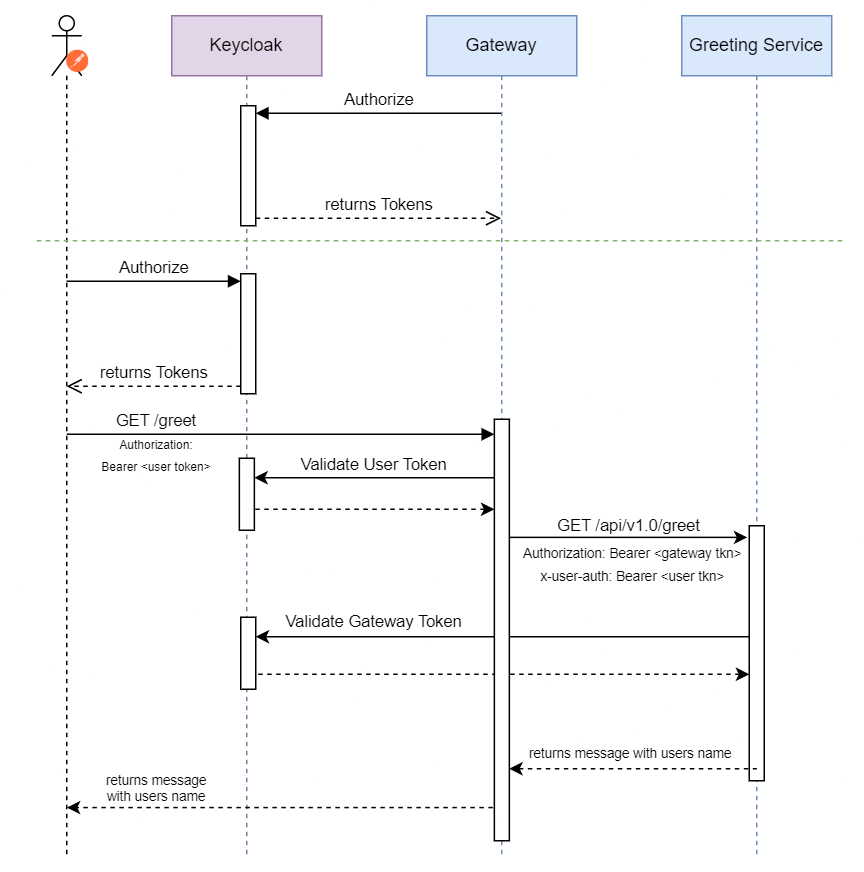

# Spring Gateway with Auth Example

Spring Cloud Gateway helps route and filter requests to the right places based on things like paths and headers. 
Built on Spring WebFlux, it's got handy features like load balancing and **security**.

## Goals of this example

- Showcase the role of a Spring Gateway in Microservice architecture
- Integrate Authentication to protect services behind the Gateway 

## Components


- "Client" - Postman Collection you can run
- Keycloak - Authorization Server
- Spring Cloud Gateway
- Greeting Service

## Folder structure

| folder            | description                                                   |
|-------------------|---------------------------------------------------------------|
| /docs             | Contains resources for readme                                 |
| /gateway          | Gateway service code                                          |
| /greeter-service  | Greeter service code                                          |
| /integration-test | Contains postman collection and environment                   |
| /keycloak-exports | Keycloak realm export that will be loaded on Keycloak startup |

## Workflow



❗Notice that we are not calling Greeting Service directly but through Spring Gateway after we authenticate.

❗Gateway sends JWT it gets from user to Greeting Service as well, this allows us to read name of an User and greet them.

## Requirements

- Docker and Docker Compose or Docker Desktop
- Postman

## How to run

- Clone this repo
- Run:
```sh 
docker compose up -d
```

## Usage

- After all services are running open Keycloak at *http://localhost:18080* and sign in as admin (pass: admin)
- Switch realm to *springboot-microservice-realm*
- Create user (don't forget to set him First and Last name):


- Set password "user" for this user (turn temporary to Off):


- Import Postman collection and environment
- Call Auth to authenticate your user (HINT: if you have different user credentials change them in environment) and then Greet

Output:

